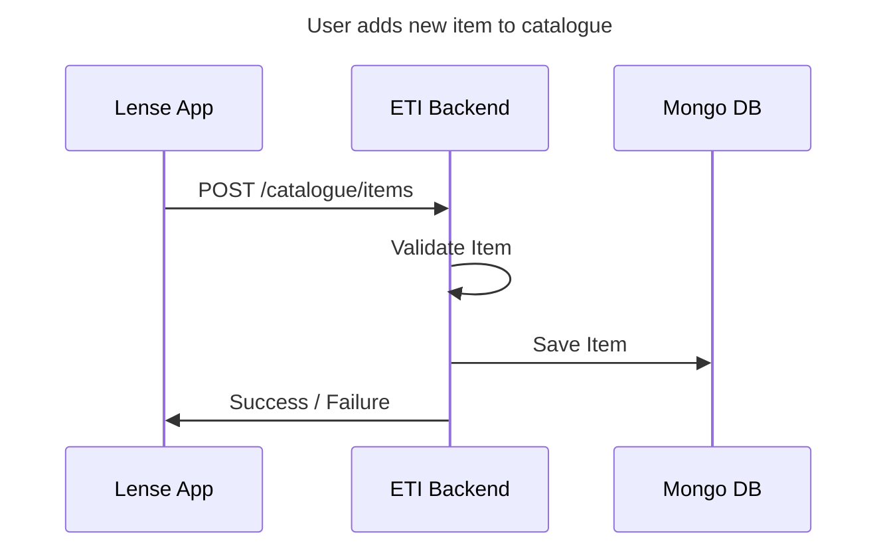

# Create Item

Creates an item in the catalogue.

## Diagram



## Request

### Route

POST /catalogue/items

### Headers

- Authorization: "Bearer {token}"

### Body

```json
{
  "name": "Tapatio 6/20oz",
  "warehouseItemNumber": "123456",
  "gpItemNumber": "8-49575-2342",
  "warehouse": "CHR"
}
```

#### Properties

| Property            | Data Type | Details                                |
| ------------------- | --------- | -------------------------------------- |
| name                | `string`  | Name of item                           |
| warehouseItemNumber | `string`  | Item number in ETI warehouse           |
| gpItemNumber        | `string`  | Microsoft Dynamics GP item number      |
| warehouse           | `string`  | Name of warehouse containing this item |

## Response

### Success

#### Status Code

201

#### Body

```json
{

}
```

##### Properties

### Errors

#### Status Codes

| Code | Scenario                 | Notes                                        |
| ---- | ------------------------ | -------------------------------------------- |
| 400  | Invalid item properties  |                                              |
| 401  | User isn't authenticated |                                              |
| 403  | User isn't authorized    |                                              |
| 5xx  | Internal server error    | If local dev, 500 errors include stack trace |

#### Body

Our errors use standard [problem details: RFC78087](https://datatracker.ietf.org/doc/html/rfc7807) format

```json
{
  "type": "about:blank",
  "title": "",
  "status": {statusCode},
  "detail": "",
  "instance": "",
  "traceId": "",
  "error": {errorCode},
  "errors": {
    {field}: [
      {
        "code": {field}/{errorCode},
        "message": {errorMessage}
      }
    ]
  }
}
```

#### Model State Errors

| Field               | Code          | Message                                                 | Scenario                                            | Notes |
| ------------------- | ------------- | ------------------------------------------------------- | --------------------------------------------------- | ----- |
| name                | empty         | 'Name' must not be empty.                               | Name is an empty string                             |       |
| name                | invalid_value | 'Name' must be a valid string less than 280 characters. | Name is not a valid string less than 280 characters |       |
| warehouseItemNumber | empty         | 'Warehouse Item Number' must not be empty.              | Warehouse Item Number is an empty string            |       |
| gpItemNumber        | empty         | 'GP Item Number' must not be empty.                     | GP Item Number is an empty string                   |       |
| gpItemNumber        | invalid_value | 'GP Item Number' must be exist in GP database.          | GP Item Number does not exist                       |       |
| warehouse           | empty         | 'Warehouse' must not be empty.                          | Warehouse is an empty string                        |       |

